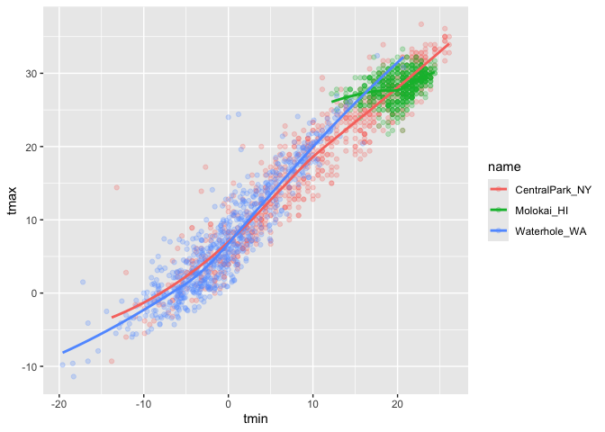
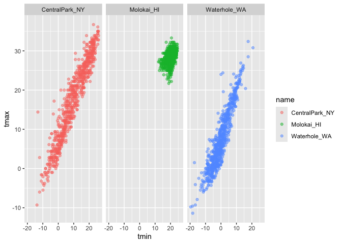
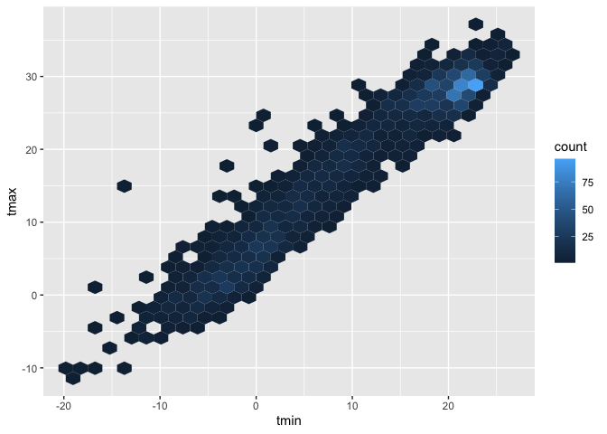
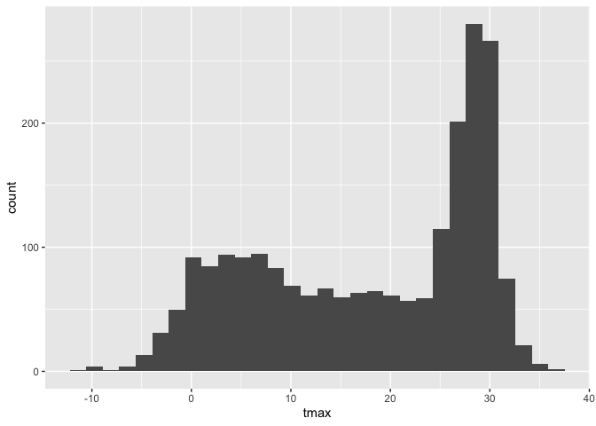
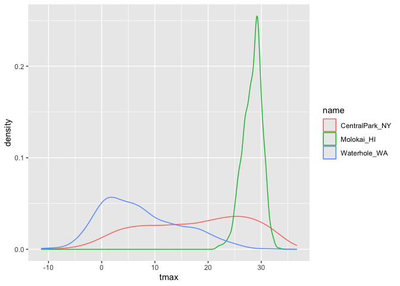
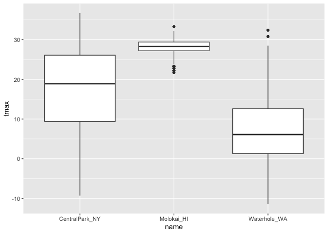
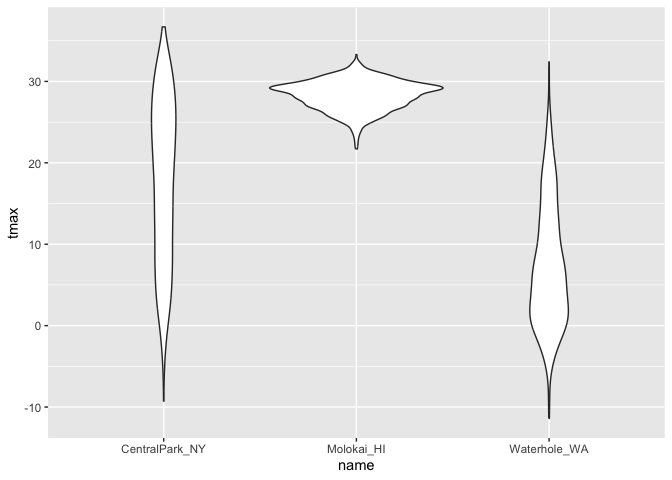
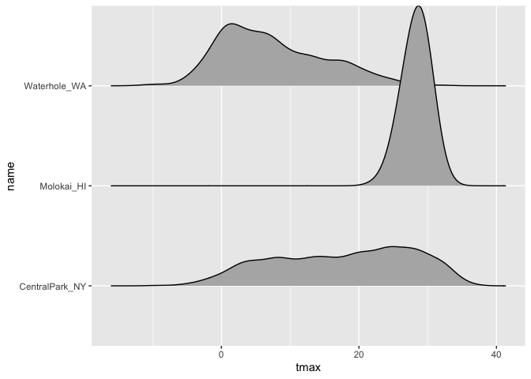
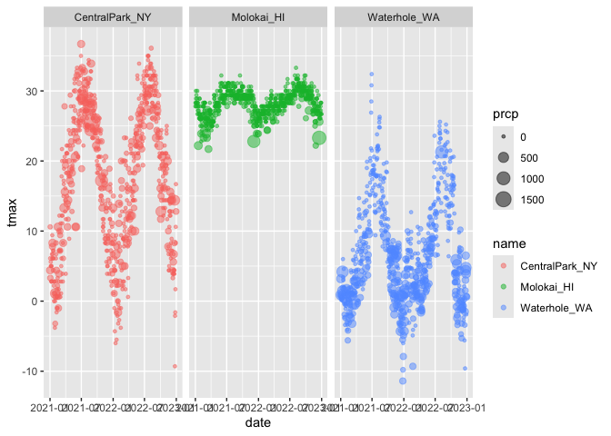
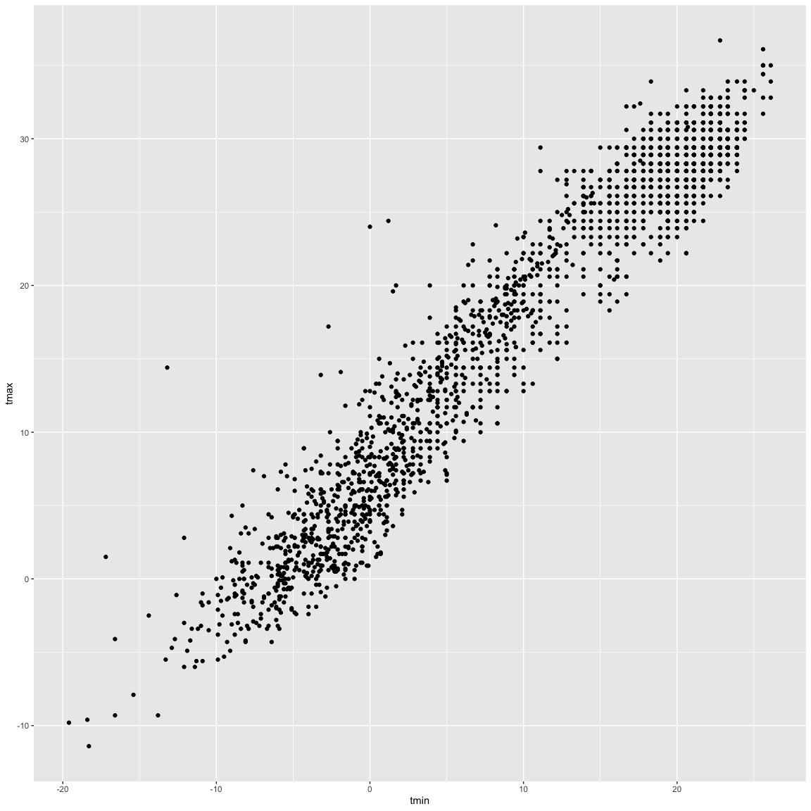

data_viz_class1
================
2026-10-01

loading packages

``` r
library(tidyverse)
library(ggridges)

library(p8105.datasets)
data("weather_df")
```

let’s make a scatterplot

``` r
ggplot(weather_df, aes(x = tmin, y = tmax)) +
  geom_point()
```

    ## Warning: Removed 17 rows containing missing values or values outside the scale range
    ## (`geom_point()`).

<!-- -->

good to start it as a dataframe

``` r
weather_df |> 
  ggplot(aes(x = tmin, y = tmax)) +
  geom_point()
```

    ## Warning: Removed 17 rows containing missing values or values outside the scale range
    ## (`geom_point()`).

<!-- -->

``` r
# good to do this to easily save the scatterplot and view it later (make it equal to a new variable)
gg_temp_scatterplot = 
  weather_df |> 
  ggplot(aes(x = tmin, y = tmax, color = name)) + #makign scatterplot fancier (add colors and line)
  geom_point(alpha = .25) +
  geom_smooth(se = FALSE)

gg_temp_scatterplot
```

    ## `geom_smooth()` using method = 'loess' and formula = 'y ~ x'

    ## Warning: Removed 17 rows containing non-finite outside the scale range
    ## (`stat_smooth()`).
    ## Removed 17 rows containing missing values or values outside the scale range
    ## (`geom_point()`).

<!-- --> show
faceting

``` r
weather_df |> 
  ggplot(aes(x = tmin, y = tmax, color = name)) +
  geom_point(alpha = .5) +
  facet_grid(. ~ name) # what vraibles do youwant separating rows (none so .), ~ what variable do you want separating columns (name)
```

    ## Warning: Removed 17 rows containing missing values or values outside the scale range
    ## (`geom_point()`).

<!-- -->

``` r
weather_df |> 
  ggplot(aes(x = tmin, y = tmax, color = name)) +
  geom_point(alpha = .5) +
  facet_grid(cols = vars(name)) # this is another way to do it, just specify the column that you want 
```

    ## Warning: Removed 17 rows containing missing values or values outside the scale range
    ## (`geom_point()`).

<!-- -->

``` r
weather_df |> 
  ggplot(aes(x=date, y = tmax, color = name)) +
  geom_point(aes(size = prcp), alpha = 0.5) + # change dot sizes based on precipitation
  geom_smooth(se = FALSE) + # se = false takes away error bars from the lines
  facet_grid(. ~ name)
```

    ## `geom_smooth()` using method = 'loess' and formula = 'y ~ x'

    ## Warning: Removed 17 rows containing non-finite outside the scale range
    ## (`stat_smooth()`).

    ## Warning: Removed 19 rows containing missing values or values outside the scale range
    ## (`geom_point()`).

<!-- --> make
a plot of central park tmax vs tmin only, and convert temperatures to
farenheit

``` r
weather_df |>
  filter(name == "CentralPark_NY") |> 
  mutate(
    tmax = tmax * (9/5) + 32,    # don't have to make a new dataframe/dataset to convert temps, can just mutate in this dataframe for this plot 
    tmin = tmin * (9/5) + 32,   # without changing the whole dataset
  ) |> 
  ggplot(aes(x = tmin, y = tmax)) + 
  geom_point()
```

<!-- -->

hex plot

``` r
weather_df |> 
  ggplot(aes(x = tmin, y = tmax)) +
  geom_hex()
```

    ## Warning: Removed 17 rows containing non-finite outside the scale range
    ## (`stat_binhex()`).

<!-- --> \#
univariate plots

``` r
weather_df |> 
  ggplot(aes(x = tmax)) +
  geom_histogram()
```

    ## `stat_bin()` using `bins = 30`. Pick better value `binwidth`.

    ## Warning: Removed 17 rows containing non-finite outside the scale range
    ## (`stat_bin()`).

<!-- -->

``` r
weather_df |> 
  ggplot(aes(x = tmax, fill = name)) +
  geom_histogram() +
  facet_grid(. ~ name)
```

    ## `stat_bin()` using `bins = 30`. Pick better value `binwidth`.

    ## Warning: Removed 17 rows containing non-finite outside the scale range
    ## (`stat_bin()`).

<!-- -->

density plots

``` r
weather_df |> 
  ggplot(aes(x = tmax, color = name)) +
  geom_density()
```

    ## Warning: Removed 17 rows containing non-finite outside the scale range
    ## (`stat_density()`).

<!-- -->

``` r
weather_df |> 
  ggplot(aes(x = tmax, fill = name)) +
  geom_density(alpha = .3) # the alpha = .3 makes the fill transparent
```

    ## Warning: Removed 17 rows containing non-finite outside the scale range
    ## (`stat_density()`).

<!-- -->
boxplots

``` r
weather_df |> 
  ggplot(aes(x = name, y = tmax)) +
  geom_boxplot()
```

    ## Warning: Removed 17 rows containing non-finite outside the scale range
    ## (`stat_boxplot()`).

<!-- -->
violin plot

``` r
weather_df |> 
  ggplot(aes(x = name, y = tmax)) +
  geom_violin()
```

    ## Warning: Removed 17 rows containing non-finite outside the scale range
    ## (`stat_ydensity()`).

<!-- -->
ridge plot

``` r
weather_df |> 
  ggplot(aes(x = tmax, y = name)) +
  geom_density_ridges()
```

    ## Picking joint bandwidth of 1.54

    ## Warning: Removed 17 rows containing non-finite outside the scale range
    ## (`stat_density_ridges()`).

<!-- -->
save some plots

``` r
ggp_weather =
  weather_df |> 
  ggplot(aes(x = date, y = tmax, color = name)) +
  geom_point(aes(size = prcp), alpha = .5) +
  facet_grid(. ~ name)

ggp_weather
```

    ## Warning: Removed 19 rows containing missing values or values outside the scale range
    ## (`geom_point()`).

<!-- -->

``` r
ggsave("ggp_weather.pdf", ggp_weather)
```

    ## Saving 7 x 5 in image

    ## Warning: Removed 19 rows containing missing values or values outside the scale range
    ## (`geom_point()`).

``` r
weather_df |> 
  ggplot(aes(x = tmin, y = tmax)) +
  geom_point()
```

    ## Warning: Removed 17 rows containing missing values or values outside the scale range
    ## (`geom_point()`).

<!-- -->
